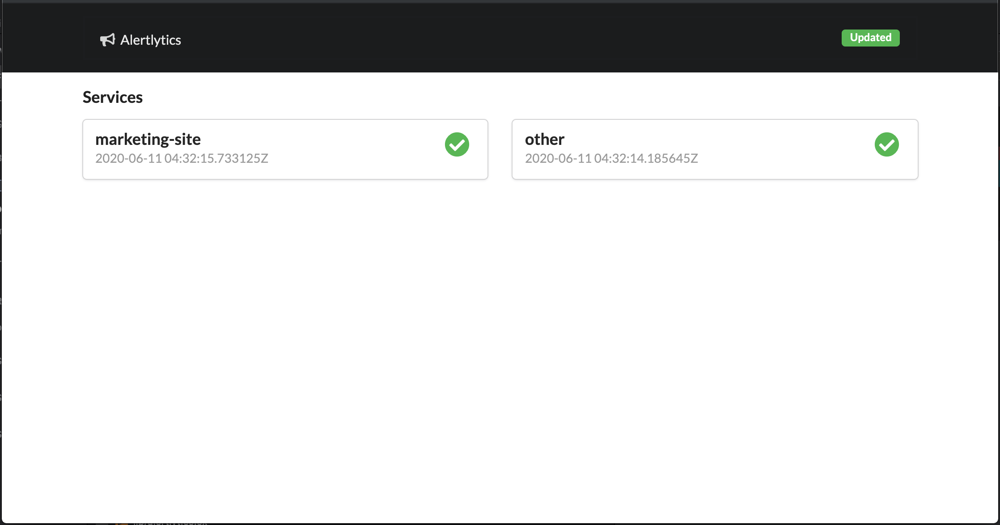

# Alertlytics

[](https://travis-ci.org/cultivatedcode/alertlytics)
[](https://coveralls.io/github/cultivatedcode/alertlytics?branch=master)
[](https://app.sourcelevel.io/github/cultivatedcode/alertlytics)
[](https://hub.docker.com/repository/docker/cultivatedcode/alertlytics)
[](https://github.com/cultivatedcode/alertlytics/blob/master/LICENSE)

## Getting started

Alertlytics works with a json config file that defines the end points you would like to monitor and at what interval.  The config file looks like this:

```
{
   "channel": "#devops",
   "services":
   [{
      "type": "web",
      "name": "marketing-site",
      "health_check_url": "https://www.cultivatedcode.com",
      "test_interval_in_minutes": 10
   },
   {
      "type": "web",
      "name": "other",
      "health_check_url": "http://web",
      "test_interval_in_minutes": 50
   }
   ]
}
```

## Dashboard UI

In your browser you can navigate to `http://localhost` to view the status of all your services.  The dashboard live reloads as services are updated behind the scenes.



## Production Monitoring

Alertlytics uses slack as it's notification engine.  Go to slack and create a custom bot to get your slack API token.  Now you can start the Alertlytics docker container by passing in your slack token as an environment variable and config file via a volume mapping to /etc/alertlytics/config.json.  Something like this:

`docker run -d -e SLACK_TOKEN=your-token-here -v $PWD/alertlytics-config.json:/etc/alertlytics/config.json cultivatedcode/alertlytics`

In slack you should see your bot come online.  You will receive alerts of any services that do not respond with a 200 status code in the slack channel you have defined in the config.json.  To view the status of the monitoring you can view docker logs.

## Local Monitoring

We use Alertlytics to monitor local development environments where we have many microservices that need to communicate.  This makes it easier to see if any of the associated services in your applications are operational.

You can run Alertlytics without slack notifications when you're running locally.  Simply don't include the slack token and now you can use the dashboard UI to monitor your services.

`docker run -d -p 80:80 -v $PWD/alertlytics-config.json:/etc/alertlytics/config.json cultivatedcode/alertlytics`
